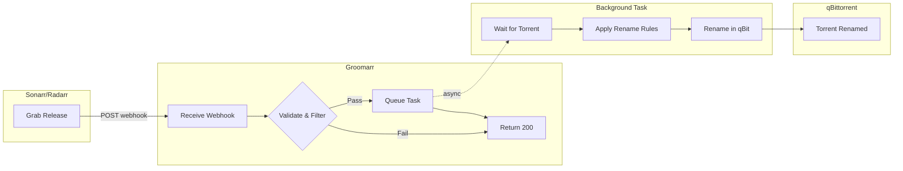

# Groomarr


A webhook service that "grooms" rough releases into presentable ones — automatically renaming torrents in qBittorrent when Sonarr or Radarr grabs a release.

Fixes infinite download loops (Couldn't add release X from Indexer Y to download queue.) in Sonarr and Radarr by renaming torrents to match their original release titles, ensuring that metadata (Custom Formats, Release Groups) lost during filename parsing is preserved.

## Features

- **Web UI**: Manage all rename rules from a modern dashboard — no YAML editing required. Edit global and per-tracker rules, **simulate** how a release would be filtered and renamed (live), and apply changes safely.
- Receives webhooks from Sonarr/Radarr on Grab events
- Renames torrents, folders, and files in qBittorrent
- Configurable trigger filters (indexer, quality, custom formats, etc.)
- Customizable rename rules (regex patterns, prefix/suffix)
- Multiple rename modes (torrent only, folder, files)
- Handles timing issues with automatic retry/polling
- **Score validation**: Optionally validates renames against Sonarr/Radarr API to ensure custom format scores aren't negatively impacted

## Web UI

Open `http://<host>:8000/` in a browser to manage Groomarr without touching YAML.

- **Rules** — Edit the global rule set and per-tracker overrides: trigger filters (indexers, qualities, custom formats, release groups, score threshold) and rename rules (prefix/suffix, remove/replace/skip patterns). Regex patterns are validated as you type. Changes are written back to `rename_rules.yaml` (the previous file is backed up to `.bak`) and reloaded automatically.
- **Simulator** — Paste a sample release (title, indexer, quality, etc.) and instantly see which tracker matched, whether it would be processed (and why not, if skipped), and the resulting renamed title with a step-by-step breakdown. Uses the exact production engine, so the preview matches reality.
- **Tools** — Preview a rename, apply a manual rename, or find a torrent by its tracker ID.
- **Status** — Connectivity (qBittorrent/Sonarr/Radarr) and the current deployment settings.

> [!WARNING]
> **Groomarr has no built-in authentication.** Anyone who can reach the port can change rules and trigger renames. Keep it on a trusted/private network or behind an authenticating reverse proxy. Do not expose port 8000 directly to the internet. Set `CONFIG_READONLY=true` to make the UI/API unable to modify rules.

## Quick Start

### 1. Clone and configure

```bash
# Copy example config
cp config/rename_rules.yaml.example config/rename_rules.yaml

# Edit config (optional - defaults work out of the box)
nano config/rename_rules.yaml
```

### 2. Start with Docker Compose

```bash
# Edit docker-compose.yml with your qBittorrent credentials
docker-compose up -d
```

### 3. Configure Sonarr/Radarr

**In Radarr:**
1. Go to Settings → Connect → + → Webhook
2. Name: `Groomarr`
3. On Grab: ✓ (enable)
4. URL: `http://groomarr:8000/webhook/radarr`
5. Method: POST
6. Click Test, then Save

**In Sonarr:**
1. Go to Settings → Connect → + → Webhook
2. Name: `Groomarr`
3. On Grab: ✓ (enable)
4. URL: `http://groomarr:8000/webhook/sonarr`
5. Method: POST
6. Click Test, then Save

## Configuration

### Environment Variables

| Variable | Default | Description |
|----------|---------|-------------|
| `QBITTORRENT_URL` | `http://qbittorrent:8080` | qBittorrent Web UI URL |
| `QBITTORRENT_USERNAME` | `admin` | qBittorrent username |
| `QBITTORRENT_PASSWORD` | `adminadmin` | qBittorrent password |
| `API_PORT` | `8000` | Port for webhook API |
| `LOG_LEVEL` | `INFO` | Logging level (DEBUG, INFO, WARNING, ERROR) |
| `LOG_FORMAT` | `text` | Log format: `text` or `json` (for log aggregation) |
| `RENAME_MODE` | `torrent_and_folder` | What to rename (see below) |
| `DRY_RUN` | `false` | If `true`, logs what would be renamed without making changes |
| `INITIAL_DELAY` | `2` | Seconds to wait before first torrent lookup |
| `MAX_RETRIES` | `10` | Max attempts to find torrent |
| `RETRY_DELAY` | `3` | Base seconds between retries (uses exponential backoff) |
| `SONARR_URL` | `null` | Sonarr API URL (for score validation) |
| `SONARR_API_KEY` | `null` | Sonarr API key (Settings → General) |
| `RADARR_URL` | `null` | Radarr API URL (for score validation) |
| `RADARR_API_KEY` | `null` | Radarr API key (Settings → General) |
| `STATIC_DIR` | `frontend/dist` | Directory of the built web UI (set automatically in the Docker image) |
| `CONFIG_READONLY` | `false` | If `true`, the web UI/API cannot modify `rename_rules.yaml` |

### Rename Modes

| Mode | Description |
|------|-------------|
| `torrent_only` | Only rename torrent display name in qBittorrent UI |
| `torrent_and_folder` | Rename torrent name + root folder (default) |
| `torrent_folder_files` | Rename torrent + folder + all files |
| `folder_only` | Only rename root folder |
| `files_only` | Only rename files |

### Rename Rules File

Create `config/rename_rules.yaml` to customize behavior. The configuration supports two formats:

1. **Legacy flat format**: All rules at root level (backward compatible)
2. **Hierarchical format**: `global` section + `trackers` list for per-indexer rules

#### Rule Resolution

When a webhook is received:
1. Check if the indexer matches any tracker in the `trackers` list (first match wins)
2. If matched → use that tracker's rules **exclusively** (global rules are NOT applied)
3. If no match → use global rules

#### Hierarchical Format (Recommended)

```yaml
# Global rules - used when no tracker-specific config matches
global:
  # Trigger filters
  indexers_exclude:
    - ".*Public.*"
  qualities_exclude:
    - "CAM"
    - "TS"
  
  # Rename rules
  prefix: ""
  suffix: ""
  
  # Score validation
  validate_custom_format_score: false
  score_validation_policy: "block"

# Tracker-specific rules - first matching tracker wins
trackers:
  - name: "my-private-tracker"
    match:
      - "MyPrivateTracker (API)"   # Exact match (case-insensitive)
      - "MyPrivateTracker*"        # Wildcard match
    rules:
      qualities_include:
        - "Bluray.*"
        - "Remux"
      prefix: "[MPT] "
      validate_custom_format_score: true

  - name: "anime-tracker"
    match:
      - "Nyaa*"
      - "AnimeBytes*"
      - "/.*anime.*/i"             # Regex match (wrapped in slashes)
    rules:
      release_groups_include:
        - "SubsPlease"
        - "Erai-raws"
      remove_patterns:
        - "\\[.*?\\]"              # Remove [tags] common in anime
      suffix: " [Anime]"
```

#### Match Pattern Types

| Pattern | Example | Matches |
|---------|---------|---------|
| Exact string | `"TrackerName"` | Case-insensitive exact match |
| Wildcard | `"Tracker*"`, `"*Cinema*"` | Shell-style glob (`*` = any chars, `?` = single char) |
| Regex | `"/Tracker.*API/"` | Regular expression (wrapped in slashes) |

#### Legacy Flat Format

For simpler setups without tracker-specific rules:

```yaml
# All rules at root level (no 'global:' or 'trackers:' sections)
indexers_include:
  - "TrackerA.*"
  - "IndexerB"

indexers_exclude:
  - ".*Public.*"

qualities_exclude:
  - "CAM"
  - "TS"

prefix: ""
suffix: ""

validate_custom_format_score: false
score_validation_policy: "block"
```

#### Available Filter Options

| Filter | Description |
|--------|-------------|
| `indexers_include` | Only process these indexers (regex) |
| `indexers_exclude` | Skip these indexers |
| `qualities_include` | Only process these qualities |
| `qualities_exclude` | Skip these qualities |
| `customformats_require_any` | Require any of these custom formats |
| `customformats_exclude` | Skip if any of these present |
| `min_customformat_score` | Minimum score threshold (null = disabled) |
| `download_clients_include` | Only process from these clients |
| `download_clients_exclude` | Skip these download clients |
| `release_groups_include` | Only process these release groups |
| `release_groups_exclude` | Skip these release groups |

#### Available Rename Rules

| Rule | Description |
|------|-------------|
| `prefix` | Add prefix to renamed titles |
| `suffix` | Add suffix to renamed titles |
| `remove_patterns` | Regex patterns to remove from title |
| `replace_patterns` | Pattern → replacement mapping |
| `skip_title_patterns` | Skip renaming if title matches these |

### Score Validation

Score validation is an optional feature that uses the Sonarr/Radarr API to compare custom format scores before and after renaming. This helps ensure that your rename rules don't accidentally remove information that Sonarr/Radarr uses for matching.

**How it works:**
1. When a rename is triggered, Groomarr calls the `/api/v3/parse` endpoint with both the original and new name
2. It compares the `customFormatScore` values returned by the API
3. Based on the policy, it either blocks or warns if the new name would have a lower score

**Configuration:**
1. Set the environment variables for Sonarr/Radarr API access
2. Enable in `rename_rules.yaml`:

```yaml
validate_custom_format_score: true
score_validation_policy: "block"  # or "warn"
```

**Policies:**
- `block` (default): Skip the rename if the score would decrease
- `warn`: Log a warning but proceed with the rename anyway

**Example log output:**
```
# Score validation passed
[radarr] Score validation: 'Original.Name' (11200) -> 'New.Name' (11200), change=0, safe=True

# Score decrease blocked
[radarr] Skipping rename: score would decrease from 11200 to 8500 (-2700)

# API unreachable
[radarr] Skipping rename: Radarr API unreachable at http://radarr:7878
```

## API Endpoints

| Endpoint | Method | Description |
|----------|--------|-------------|
| `/` | GET | Web UI (single-page app) |
| `/health` | GET | Health check |
| `/webhook/radarr` | POST | Radarr webhook receiver |
| `/webhook/sonarr` | POST | Sonarr webhook receiver |
| `/rename/manual` | POST | Manually rename a torrent by hash |
| `/rename/preview` | POST | Preview what a rename operation would do without making changes |
| `/find/torrent` | POST | Find a torrent by its tracker ID (URL or number) |
| `/reload` | GET | Reload rename rules |
| `/api/config` | GET / PUT | Read or save rename rules (used by the web UI) |
| `/api/rules/simulate` | POST | Simulate filtering + renaming for a sample release |
| `/api/rules/validate-pattern` | POST | Validate a regex or indexer match pattern |
| `/api/settings` | GET | Non-sensitive runtime settings |
| `/api/status` | GET | Service + connectivity status |
| `/docs` | GET | Swagger API documentation |

### Manual Rename Endpoint

The `/rename/manual` endpoint allows direct renaming of torrents without a webhook event:

```bash
curl -X POST http://localhost:8000/rename/manual \
  -H "Content-Type: application/json" \
  -d '{
    "torrent_hash": "AF35BC0E03A9D8405779A69FC9A438F1BFE90C5F",
    "new_name": "Movie.2024.1080p.BluRay.x264-GROUP",
    "mode": "torrent_and_folder"
  }'
```

**Parameters:**
- `torrent_hash` (required): The torrent info hash
- `new_name` (required): New name to apply
- `mode` (optional): Rename mode (default: `torrent_and_folder`)

### Preview Rename Endpoint

The `/rename/preview` endpoint shows exactly what would happen if you performed a rename operation without actually making any changes. This is useful for testing rename rules or verifying behavior before committing to a rename.

```bash
curl -X POST http://localhost:8000/rename/preview \
  -H "Content-Type: application/json" \
  -d '{
    "torrent_hash": "AF35BC0E03A9D8405779A69FC9A438F1BFE90C5F",
    "new_name": "Movie.2024.1080p.BluRay.x264-GROUP",
    "mode": "torrent_folder_files"
  }'
```

**Parameters:**
- `torrent_hash` (required): The torrent info hash
- `new_name` (required): New name to preview
- `mode` (optional): Rename mode to preview (default: `torrent_and_folder`)

**Response includes:**
- Current state: torrent name, root folder, total files
- Proposed changes: new torrent name, new folder name, list of file renames
- Change indicators: which items will actually change
- Warnings: any issues detected (e.g., conflicts, missing folders)

This endpoint is read-only and never modifies your torrents, making it safe to use for testing and validation.

## Example docker-compose.yml

```yaml
services:
  groomarr:
    image: maksii/groomarr:latest
    container_name: groomarr
    environment:
      - QBITTORRENT_URL=http://qbittorrent:8080
      - QBITTORRENT_USERNAME=admin
      - QBITTORRENT_PASSWORD=your_password
      - RENAME_MODE=torrent_and_folder
      # Optional: Enable score validation (requires Arr API access)
      # - SONARR_URL=http://sonarr:8989
      # - SONARR_API_KEY=your-sonarr-api-key
      # - RADARR_URL=http://radarr:7878
      # - RADARR_API_KEY=your-radarr-api-key
    volumes:
      - ./config:/config
    ports:
      - "8000:8000"
    restart: unless-stopped
    networks:
      - media  # Same network as qBittorrent, Sonarr, Radarr

networks:
  media:
    external: true
```

## How It Works

1. Sonarr/Radarr grabs a release and sends webhook to this service
2. Service validates the webhook and applies trigger filters
3. If filters pass, a background task is queued
4. Background task waits for torrent to appear in qBittorrent (with retries)
5. Rename rules are applied to generate new name
6. Torrent/folder/files are renamed based on configured mode



## Troubleshooting

### Torrent not found after retries

- Increase `MAX_RETRIES` or `RETRY_DELAY`
- Check qBittorrent is accessible from the container
- Verify `QBITTORRENT_URL` is correct

### Webhook not received

- Check Sonarr/Radarr can reach the service URL
- Verify firewall/network settings
- Check logs: `docker logs groomarr`

### Filter not working

- All filter patterns are regex (case-insensitive)
- Use `docker logs` to see skip reasons
- Test patterns at https://regex101.com

### Check logs

```bash
docker logs -f groomarr
```

## Development

### Run locally

```bash
# Install backend dependencies
pip install -r requirements.txt

# Build the web UI (served by FastAPI at /)
cd frontend && npm ci && npm run build && cd ..

# Run the backend
python -m uvicorn src.main:app --reload --port 8000
```

Then open `http://localhost:8000/`.

### Web UI development

For a fast frontend dev loop with hot-reload, run the Vite dev server alongside the backend. It proxies API/webhook requests to `http://localhost:8000`:

```bash
# Terminal 1 — backend
python -m uvicorn src.main:app --reload --port 8000

# Terminal 2 — frontend dev server (http://localhost:5173)
cd frontend
npm install
npm run dev
```

Build a production bundle with `npm run build` (runs `tsc` type-checking, then Vite). The Docker image builds this automatically in a multi-stage build.

### Run tests

```bash
# Backend
pip install pytest
pytest tests/ -v

# Frontend type-check + build
cd frontend && npm run build
```

## Requirements

- qBittorrent v4.2.1+ (for file renaming support)
- Sonarr v3+ / Radarr v3+
- Docker (recommended)

## Contributing

Contributions are welcome! Please feel free to submit a Pull Request.

1. Fork the repository
2. Create your feature branch (`git checkout -b feature/amazing-feature`)
3. Run the tests (`pytest tests/ -v`)
4. Commit your changes (`git commit -m 'Add amazing feature'`)
5. Push to the branch (`git push origin feature/amazing-feature`)
6. Open a Pull Request

## License

MIT
