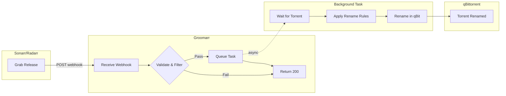

# Groomarr


Fixes infinite download loops in Sonarr and Radarr by renaming torrents to match their original release titles, ensuring that metadata (Custom Formats, Release Groups) lost during filename parsing is preserved.

A webhook service that "grooms" rough releases into presentable ones — automatically renaming torrents in qBittorrent when Sonarr or Radarr grabs a release.

## Features

- Receives webhooks from Sonarr/Radarr on Grab events
- Renames torrents, folders, and files in qBittorrent
- Configurable trigger filters (indexer, quality, custom formats, etc.)
- Customizable rename rules (regex patterns, prefix/suffix)
- Multiple rename modes (torrent only, folder, files)
- Handles timing issues with automatic retry/polling
- **Score validation**: Optionally validates renames against Sonarr/Radarr API to ensure custom format scores aren't negatively impacted

## Quick Start

### 1. Clone and configure

```bash
# Copy example config
cp config/rename_rules.yaml.example config/rename_rules.yaml

# Edit config (optional - defaults work out of the box)
nano config/rename_rules.yaml
```

### 2. Start with Docker Compose

```bash
# Edit docker-compose.yml with your qBittorrent credentials
docker-compose up -d
```

### 3. Configure Sonarr/Radarr

**In Radarr:**
1. Go to Settings → Connect → + → Webhook
2. Name: `Groomarr`
3. On Grab: ✓ (enable)
4. URL: `http://groomarr:8000/webhook/radarr`
5. Method: POST
6. Click Test, then Save

**In Sonarr:**
1. Go to Settings → Connect → + → Webhook
2. Name: `Groomarr`
3. On Grab: ✓ (enable)
4. URL: `http://groomarr:8000/webhook/sonarr`
5. Method: POST
6. Click Test, then Save

## Configuration

### Environment Variables

| Variable | Default | Description |
|----------|---------|-------------|
| `QBITTORRENT_URL` | `http://qbittorrent:8080` | qBittorrent Web UI URL |
| `QBITTORRENT_USERNAME` | `admin` | qBittorrent username |
| `QBITTORRENT_PASSWORD` | `adminadmin` | qBittorrent password |
| `API_PORT` | `8000` | Port for webhook API |
| `LOG_LEVEL` | `INFO` | Logging level (DEBUG, INFO, WARNING, ERROR) |
| `LOG_FORMAT` | `text` | Log format: `text` or `json` (for log aggregation) |
| `RENAME_MODE` | `torrent_and_folder` | What to rename (see below) |
| `DRY_RUN` | `false` | If `true`, logs what would be renamed without making changes |
| `INITIAL_DELAY` | `2` | Seconds to wait before first torrent lookup |
| `MAX_RETRIES` | `10` | Max attempts to find torrent |
| `RETRY_DELAY` | `3` | Base seconds between retries (uses exponential backoff) |
| `SONARR_URL` | `null` | Sonarr API URL (for score validation) |
| `SONARR_API_KEY` | `null` | Sonarr API key (Settings → General) |
| `RADARR_URL` | `null` | Radarr API URL (for score validation) |
| `RADARR_API_KEY` | `null` | Radarr API key (Settings → General) |

### Rename Modes

| Mode | Description |
|------|-------------|
| `torrent_only` | Only rename torrent display name in qBittorrent UI |
| `torrent_and_folder` | Rename torrent name + root folder (default) |
| `torrent_folder_files` | Rename torrent + folder + all files |
| `folder_only` | Only rename root folder |
| `files_only` | Only rename files |

### Rename Rules File

Create `config/rename_rules.yaml` to customize behavior:

```yaml
# ===========================================
# TRIGGER FILTERS - Control WHEN to rename
# ===========================================

# Only process these indexers (regex, case-insensitive)
indexers_include:
  - "TrackerA.*"
  - "IndexerB"

# Skip these indexers
indexers_exclude:
  - ".*Public.*"

# Only process these qualities
qualities_include: []  # Empty = all

# Skip these qualities
qualities_exclude:
  - "CAM"
  - "TS"
  - ".*480p.*"

# Require any of these custom formats (Radarr/Sonarr v4+)
customformats_require_any: []

# Skip if any of these custom formats present
customformats_exclude:
  - "3D"

# Minimum custom format score
min_customformat_score: null  # e.g., 1000

# Download client filtering
download_clients_include: []
download_clients_exclude: []

# Release group filtering
release_groups_include: []
release_groups_exclude:
  - "LowQualityGroup"

# ===========================================
# RENAME RULES - Control HOW to rename
# ===========================================

# Add prefix/suffix
prefix: ""
suffix: ""

# Patterns to remove (regex)
remove_patterns:
  - "-\\w+$"           # Remove release group at end

# Pattern replacements
replace_patterns:
  "\\.": " "           # Dots to spaces
  "\\s+": " "          # Multiple spaces to single

# Skip renaming if title matches these patterns
skip_title_patterns:
  - "PROPER"

# ===========================================
# SCORE VALIDATION - Validate renames via Arr API
# ===========================================
validate_custom_format_score: false
score_validation_policy: "block"  # "block" or "warn"
```

### Score Validation

Score validation is an optional feature that uses the Sonarr/Radarr API to compare custom format scores before and after renaming. This helps ensure that your rename rules don't accidentally remove information that Sonarr/Radarr uses for matching.

**How it works:**
1. When a rename is triggered, Groomarr calls the `/api/v3/parse` endpoint with both the original and new name
2. It compares the `customFormatScore` values returned by the API
3. Based on the policy, it either blocks or warns if the new name would have a lower score

**Configuration:**
1. Set the environment variables for Sonarr/Radarr API access
2. Enable in `rename_rules.yaml`:

```yaml
validate_custom_format_score: true
score_validation_policy: "block"  # or "warn"
```

**Policies:**
- `block` (default): Skip the rename if the score would decrease
- `warn`: Log a warning but proceed with the rename anyway

**Example log output:**
```
# Score validation passed
[radarr] Score validation: 'Original.Name' (11200) -> 'New.Name' (11200), change=0, safe=True

# Score decrease blocked
[radarr] Skipping rename: score would decrease from 11200 to 8500 (-2700)

# API unreachable
[radarr] Skipping rename: Radarr API unreachable at http://radarr:7878
```

## API Endpoints

| Endpoint | Method | Description |
|----------|--------|-------------|
| `/health` | GET | Health check |
| `/webhook/radarr` | POST | Radarr webhook receiver |
| `/webhook/sonarr` | POST | Sonarr webhook receiver |
| `/rename/manual` | POST | Manually rename a torrent by hash |
| `/reload` | GET | Reload rename rules |
| `/docs` | GET | Swagger API documentation |

### Manual Rename Endpoint

The `/rename/manual` endpoint allows direct renaming of torrents without a webhook event:

```bash
curl -X POST http://localhost:8000/rename/manual \
  -H "Content-Type: application/json" \
  -d '{
    "torrent_hash": "AF35BC0E03A9D8405779A69FC9A438F1BFE90C5F",
    "new_name": "Movie.2024.1080p.BluRay.x264-GROUP",
    "mode": "torrent_and_folder"
  }'
```

**Parameters:**
- `torrent_hash` (required): The torrent info hash
- `new_name` (required): New name to apply
- `mode` (optional): Rename mode (default: `torrent_and_folder`)

## Example docker-compose.yml

```yaml
services:
  groomarr:
    build: .
    container_name: groomarr
    environment:
      - QBITTORRENT_URL=http://qbittorrent:8080
      - QBITTORRENT_USERNAME=admin
      - QBITTORRENT_PASSWORD=your_password
      - RENAME_MODE=torrent_and_folder
      # Optional: Enable score validation (requires Arr API access)
      # - SONARR_URL=http://sonarr:8989
      # - SONARR_API_KEY=your-sonarr-api-key
      # - RADARR_URL=http://radarr:7878
      # - RADARR_API_KEY=your-radarr-api-key
    volumes:
      - ./config:/config
    ports:
      - "8000:8000"
    restart: unless-stopped
    networks:
      - media  # Same network as qBittorrent, Sonarr, Radarr

networks:
  media:
    external: true
```

## How It Works

1. Sonarr/Radarr grabs a release and sends webhook to this service
2. Service validates the webhook and applies trigger filters
3. If filters pass, a background task is queued
4. Background task waits for torrent to appear in qBittorrent (with retries)
5. Rename rules are applied to generate new name
6. Torrent/folder/files are renamed based on configured mode



## Troubleshooting

### Torrent not found after retries

- Increase `MAX_RETRIES` or `RETRY_DELAY`
- Check qBittorrent is accessible from the container
- Verify `QBITTORRENT_URL` is correct

### Webhook not received

- Check Sonarr/Radarr can reach the service URL
- Verify firewall/network settings
- Check logs: `docker logs groomarr`

### Filter not working

- All filter patterns are regex (case-insensitive)
- Use `docker logs` to see skip reasons
- Test patterns at https://regex101.com

### Check logs

```bash
docker logs -f groomarr
```

## Development

### Run locally

```bash
# Install dependencies
pip install -r requirements.txt

# Run
python -m uvicorn src.main:app --reload --port 8000
```

### Run tests

```bash
pip install pytest
pytest tests/ -v
```

## Requirements

- qBittorrent v4.2.1+ (for file renaming support)
- Sonarr v3+ / Radarr v3+
- Docker (recommended)

## Contributing

Contributions are welcome! Please feel free to submit a Pull Request.

1. Fork the repository
2. Create your feature branch (`git checkout -b feature/amazing-feature`)
3. Run the tests (`pytest tests/ -v`)
4. Commit your changes (`git commit -m 'Add amazing feature'`)
5. Push to the branch (`git push origin feature/amazing-feature`)
6. Open a Pull Request

## License

MIT
